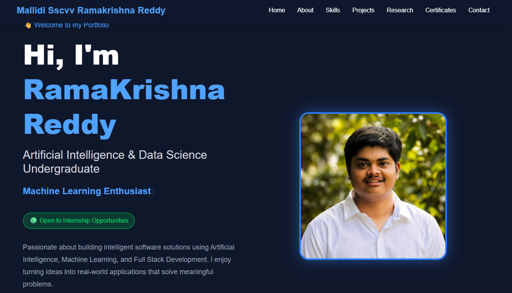

# 🌐 Personal Portfolio Website

A modern, responsive personal portfolio built using **React.js**, **Vite**, and **Tailwind CSS** to showcase my projects, research, technical skills, certifications, and contact information.

## 🚀 Live Demo

🔗 **Portfolio:** https://portfolio-eosin-chi-88.vercel.app

---

## 📸 Preview



> Replace `portfolio-preview.png` with a screenshot of your homepage.

---

## ✨ Features

- 👋 Modern Hero Section
- 👨 About Me
- 📊 Animated Statistics
- 💻 Technical Skills
- 🚀 Featured Projects
- 📄 Research & Innovation
- 🏆 Certifications
- 📬 Contact Form (EmailJS)
- 📄 Resume Download
- ⬆️ Back to Top Button
- 📱 Fully Responsive Design
- ☁️ Deployed on Vercel

---

## 🛠️ Tech Stack

### Frontend
- React.js
- Vite
- Tailwind CSS
- Framer Motion

### Libraries
- React Icons
- React Scroll
- React Simple Typewriter
- EmailJS

### Deployment
- GitHub
- Vercel

---

## 🚀 Projects Featured

### 🔹 Smart Attendance Guard
- Secure attendance management system
- Dynamic QR Code authentication
- Geofencing
- JWT Authentication
- SQLite Database
- Research publication

### 🔹 AI Subtitle Generator
- AI-powered subtitle generation
- OpenAI Whisper
- Multi-language translation
- Streamlit
- FFmpeg
- MoviePy

### 🔹 Clinic Management System
- Python & MySQL
- Patient Management
- Appointment Scheduling
- Billing System
- SQL Procedures & Triggers

---

## 📄 Research

**Smart Attendance Guard**

A multi-layer secure authentication framework using Dynamic QR Codes and Geofencing for secure real-time attendance verification.

---

## 📬 Contact

**Mallidi SSCVV Ramakrishna Reddy**

📧 Email: mallidisairamareddy40@gmail.com

💼 LinkedIn:
https://www.linkedin.com/in/sairamareddy-mallidi-b25b96325/

💻 GitHub:
https://github.com/sairamareddy2

🌐 Portfolio:
https://portfolio-eosin-chi-88.vercel.app

---

## 📥 Installation

Clone the repository

```bash
git clone https://github.com/sairamareddy2/portfolio.git
```

Go to the project

```bash
cd portfolio
```

Install dependencies

```bash
npm install
```

Run the development server

```bash
npm run dev
```

Build for production

```bash
npm run build
```

---

## 📂 Project Structure

```
src
│
├── assets
│   ├── certificates
│   ├── images
│   └── resume
│
├── components
│   ├── Navbar
│   ├── Hero
│   ├── About
│   ├── Stats
│   ├── Skills
│   ├── Projects
│   ├── Research
│   ├── Certificates
│   ├── Contact
│   ├── Footer
│   └── BackToTop
│
├── App.jsx
├── main.jsx
└── index.css
```

---

## 📈 Future Improvements

- 🌙 Dark/Light Theme
- 🌐 Custom Domain
- 📊 GitHub Statistics
- 📝 Blog Section
- 🎥 Project Demo Videos

---

## 📄 License

This project is open-source and available for learning purposes.

---

## ⭐ Support

If you like this project, consider giving it a ⭐ on GitHub.

---

### 👨‍💻 Developed by

**Mallidi SSCVV Ramakrishna Reddy**

**AI & Data Science Undergraduate | Full Stack Developer | Machine Learning Enthusiast**